# FlappyBird en Python con Pygame

## Contenido

- [Introducción](#introducción)
  - [Fuente del tutorial](#fuente-del-tutorial)
  - [Código fuente](#código-fuente)
  - [Recomendaciones antes de iniciar](#recomendaciones-antes-de-iniciar)
- [Instalación de pygame](#instalación-de-pygame)
- [Creación del juego](#creación-del-juego)
  - [Preparación del entorno de trabajo](#preparación-del-entorno-de-trabajo)
  - [Importando pygame](#importando-pygame)
  - [Creando la ventana del juego](#creando-la-ventana-del-juego)
  - [Añadiendo el fondo](#añadiendo-el-fondo)
  - [Agregando el suelo](#agregando-el-suelo)
  - [Añadiendo el ave](#añadiendo-el-ave)
  - [Agregando la gravedad](#agregando-la-gravedad)
  - [Añadiendo el salto](#añadiendo-el-salto)
  - [Agregando los tubos](#agregando-los-tubos)
  - [Terminando los tubos](#terminando-los-tubos)
  - [Creando el sistema de colisiones](#creando-el-sistema-de-colisiones)
  - [Girando el ave](#girando-el-ave)
  - [Animando el ave](#animando-el-ave)
  - [Agregando el sistema de puntuación](#agregando-el-sistema-de-puntuación)
  - [Agregando la pantalla de game over](#agregando-la-pantalla-de-game-over)
  - [Agregando el sonido](#agregando-el-sonido)

## Introducción

### Fuente del tutorial

El presente tutorial está basado en el tutorial realizado por [Clear Code](https://www.youtube.com/c/ClearCode/featured 'Canal en Youtube'), el cual consiste en los siguientes 2 vídeos:

- [Learning pygame by making Flappy Bird](https://www.youtube.com/watch?v=UZg49z76cLw)
- [Learning pygame by making Flappy Bird - Update: Better score + better asset management + Pygame 2](https://www.youtube.com/watch?v=XRw1FUEsSv4)

Puesto que el es el creador original del código que veremos a continuación, les recomiendo dar un vistazo a sus videos y dejar su Me gusta.

### Código fuente

El código fuente que se obtiene al final de este tutorial está disponible para su descarga en el proyecto [flappy-bird](https://github.com/danielq1117/flappy-bird).

### Recomendaciones antes de iniciar

Para comenzar este tutorial es necesario tener instalado [python](https://www.python.org) en el ordenador, y que este esté en el PATH del sistema.

Además es recomendable tener un editor de código como [Visual Studio Code](https://code.visualstudio.com).

## Instalación de pygame

Para instalar pygame en nuestro ordenador, ejecutaremos el símbolo del sistema como administrador.

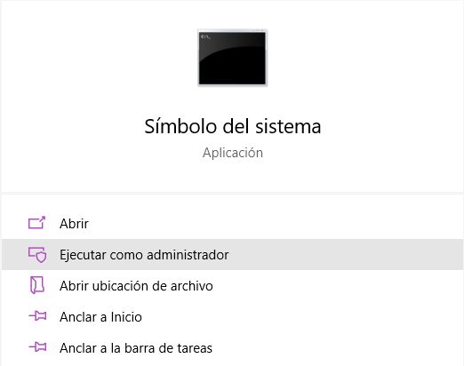

Enseguida ejecutaremos el siguiente comando:

`pip install pygame`

y esperaremos a que se instale pygame en nuestro equipo.

## Creación del juego

### Preparación del entorno de trabajo

En una carpeta nueva insertaremos los
[recursos](Recursos.zip 'Recursos.zip')
para el proyecto, que consisten en las imágenes, los sonidos y la fuente para el
mismo.

Enseguida crearemos en nuestra carpeta el archivo en donde escribiremos el
código, que en mi caso será `flap.py`. Para realizar esto, se recomienda abrir la carpeta de nuestro proyecto en Visual Studio Code. De esta forma, la estructura del proyecto
quedará de la siguiente manera:

```
├───assets/
│   └───...
├───sound/
│   └───...
├───04B_19.TTF
└───flap.py
```

### Importando pygame

Para comprobar que pygame se haya instalado correctamente, escribiremos el
siguiente código en `flap.py`:

<pre><code><div style="background: #B3FFC6">import pygame, sys, random</div></code></pre>

Lo ejecutaremos en el símbolo del sistema, que podremos abrir dentro de Visual Studio Code con el comando `Ctrl + Ñ`, de la siguiente forma:

`python flap.py`

Y como resultado nos debe mostrar algo así:

```
pygame 2.0.1 (SDL 2.0.14, Python 3.9.1)
Hello from the pygame community. https://www.pygame.org/contribute.html
```

### Creando la ventana del juego

Enseguida agregaremos lo siguiente en `flap.py`:

<pre><code>import pygame, sys, random
<div style="background: #B3FFC6">
pygame.init()
pantalla = pygame.display.set_mode((288,512))
reloj = pygame.time.Clock()

while True:
  for event in pygame.event.get():
    if event.type == pygame.QUIT:
      pygame.quit()
      sys.exit()

  pygame.display.update()
  reloj.tick(60)
</div></code></pre>

El código anterior se divide en dos partes. La primera es donde inicializaremos
el juego, y la segunda es el ciclo, en donde se actualizará el estado del juego
constantemente, y que consiste en el ciclo `while True:`.

Con `pygame.init()` inicializamos pygame,
con `pantalla = pygame.display.set_mode((288,512))` establecemos el ancho y alto
de nuestra ventana, y con `reloj = pygame.time.Clock()` creamos el reloj con el
que controlaremos el tiempo en el juego.

Dentro de nuestro ciclo (`while True:`) detectamos todos los eventos (`for event in pygame.event.get()`), y si el evento es
`pygame.QUIT`, que se activa cuando cerramos la ventana del juego, se finaliza
pygame (`pygame.quit()`) y se cierra el juego con `sys.exit()`.

Al final de nuestro ciclo actualizamos la ventana del juego (`pygame.display.update()`) y limitamos la
velocidad a la que este se ejecuta a 60 ciclos por segundo (`reloj.tick(60)`).

Si ejecutamos nuestro juego ahora, lo único que veremos será una pantalla en
negro, que podremos cerrar ya que detectamos el evento `pygame.QUIT`.

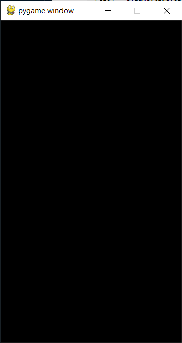

### Añadiendo el fondo

Para añadir el fondo crearemos una superficie, que añadiremos a nuestra pantalla
en cada ciclo para que siempre se muestre, de la siguiente forma:

<pre><code><div style="background: #CCE5FF">...</div>pantalla = pygame.display.set_mode((288,512))
reloj = pygame.time.Clock()

<div style="background: #B3FFC6">superficie_fondo = pygame.image.load('assets/background-day.png').convert()

</div>while True:
  for event in pygame.event.get():
    if event.type == pygame.QUIT:
      pygame.quit()
      sys.exit()
<div style="background: #B3FFC6">
  pantalla.blit(superficie_fondo, (0,0))
</div>
  pygame.display.update()
  reloj.tick(60)</code></pre>

Con la línea `superficie_fondo = pygame.image.load('assets/background-day.png').convert()`
guardamos la imagen que utilizaremos como fondo en una variable para poderla
utilizar, y en la línea `pantalla.blit(superficie_fondo, (0,0))` ponemos esa
imagen en la pantalla, estableciendo sus coordenadas.

Si ejecutamos nuestro juego de nuevo, ahora nos mostrará una ventana con nuestro
fondo.

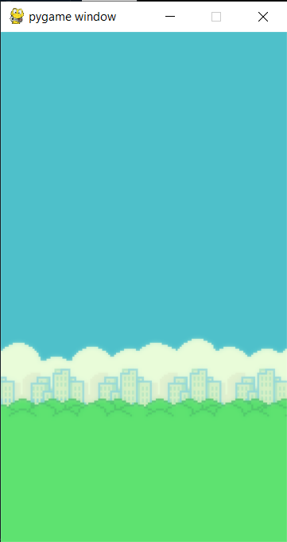

### Agregando el suelo

Para agregar el suelo haremos algo muy parecido a lo que hicimos con el fondo:

<pre><code><div style="background: #CCE5FF">...
</div>reloj = pygame.time.Clock()

superficie_fondo = pygame.image.load('assets/background-day.png').convert()
<div style="background: #B3FFC6">superficie_suelo = pygame.image.load('assets/base.png').convert()</div>
while True:
  for event in pygame.event.get():<div style="background: #CCE5FF">...
</div>      sys.exit()

  pantalla.blit(superficie_fondo,(0,0))
<div style="background: #B3FFC6">
  pantalla.blit(superficie_suelo,(0,450))
</div>
  pygame.display.update()
  reloj.tick(60)</code></pre>

Si ejecutamos nuestro código veremos algo así:

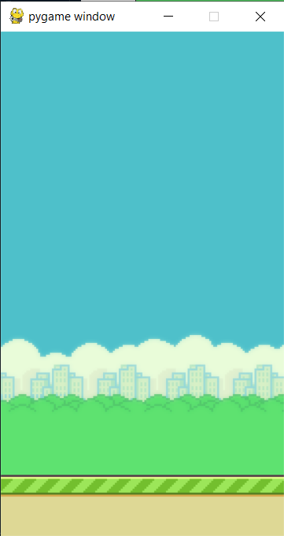

Ahora vamos a añadirle movimiento. Para ello crearemos una variable en donde
guardaremos la posición horizontal del suelo y la moveremos un poco a la
izquierda en cada ciclo, de la siguiente forma:

<pre><code><div style="background: #CCE5FF">...</div>
superficie_fondo = pygame.image.load('assets/background-day.png').convert()
superficie_suelo = pygame.image.load('assets/base.png').convert()
<div style="background: #B3FFC6">pos_suelo_x = 0</div>
while True:
  for event in pygame.event.get():
<div style="background: #CCE5FF"div>...</div>
  pantalla.blit(superficie_fondo, (0,0))

<div style="background: #FFCCD2">  pantalla.blit(superficie_suelo,(0,450))</div><div style="background: #B3FFC6">  pos_suelo_x -= 1
  pantalla.blit(superficie_suelo,(pos_suelo_x,450))</div>
  pygame.display.update()
  reloj.tick(60)</code></pre>

Si ejecutamos nuestro juego veremos lo siguiente:

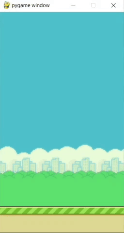

¡Nuestro suelo desaparece! Para arreglarlo añadiremos un segundo suelo que esté
a la derecha del primero, y además resetearemos su posición cuando se hayan
movido el equivalente al ancho de la pantalla, de la siguiente forma:

<pre><code><div style="background: #CCE5FF">...</div>  pos_suelo_x -= 1
  pantalla.blit(superficie_suelo,(pos_suelo_x,450))
<div style="background: #B3FFC6">  pantalla.blit(superficie_suelo,(pos_suelo_x + 288,450))
  if pos_suelo_x <= -288:
    pos_suelo_x = 0</div>
  pygame.display.update()
  reloj.tick(60)</code></pre>

Si volvemos a ejecutar nuestro juego veremos que el suelo se mueve pero sin
desaparecer de nuestra pantalla.

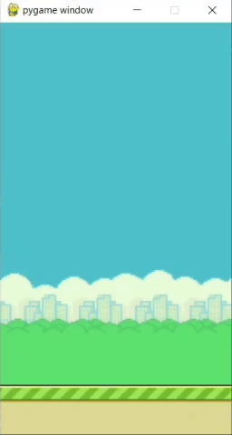

### Añadiendo el ave

Para agregar el ave crearemos una superficie como lo hicimos con el fondo y el suelo.
Además crearemos un rectángulo, ya que este nos servirá más adelante para detectar
colisiones.

<pre><code><div style="background: #CCE5FF">...</div>superficie_suelo = pygame.image.load('assets/base.png').convert()
pos_suelo_x = 0

<div style="background: #B3FFC6">superficie_ave = pygame.image.load('assets/bluebird-midflap.png').convert()
rect_ave = superficie_ave.get_rect(center = (50,256))

</div>while True:
  for event in pygame.event.get():
    if event.type == pygame.QUIT:
      pygame.quit()
      sys.exit()

  pantalla.blit(superficie_fondo, (0,0))
<div style="background: #B3FFC6">  pantalla.blit(superficie_ave,rect_ave)</div>  pos_suelo_x -= 1
  pantalla.blit(superficie_suelo,(pos_suelo_x,450))
  pantalla.blit(superficie_suelo,(pos_suelo_x + 288,450))
</code></pre>

En la línea donde creamos el rectángulo, establecemos las coordenadas del centro de la misma.
Si ejecutamos el juego, veremos al ave flotando en el aire.

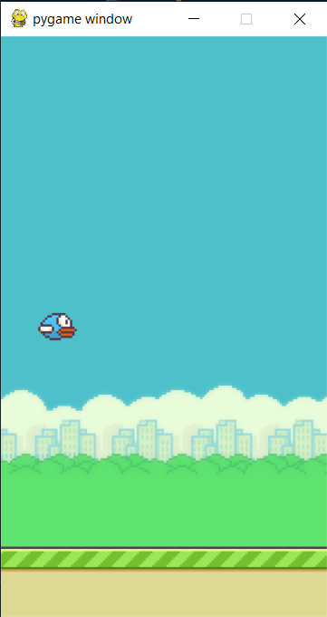

### Agregando la gravedad

Para agregar la gravedad en el juego, vamos a crear dos variables, una en la que se almacena
el valor de esta, y otra que va a almacenar la velocidad a la que cae el ave. En cada ciclo
aumentaremos la velocidad de caída y modificaremos la coordenada y del ave en función de
su velocidad.

<pre><code><div style="background: #CCE5FF">...</div>pantalla = pygame.display.set_mode((288,512))
reloj = pygame.time.Clock()

<div style="background: #B3FFC6"># Variables del Juego
gravedad = 0.25
movimiento_ave = 0

</div>superficie_fondo = pygame.image.load('assets/background-day.png').convert()
superficie_suelo = pygame.image.load('assets/base.png').convert()
pos_suelo_x = 0
<div style="background: #CCE5FF">...</div>      sys.exit()

  pantalla.blit(superficie_fondo, (0,0))
<div style="background: #B3FFC6">
  movimiento_ave += gravedad
  rect_ave.centery += movimiento_ave</div>  pantalla.blit(superficie_ave,rect_ave)
  pos_suelo_x -= 1
  pantalla.blit(superficie_suelo,(pos_suelo_x,450))
</code></pre>

Si ejecutamos el juego en este momento, veremos como cae el ave.


### Añadiendo el salto

Para añadir el salto, deberemos detectar cuando el usuario apriete la barra espaciadora.
Para hacerlo detectaremos si hay un evento que sea la presión de una tecla (`pygame.KEYDOWN`),
y en caso de haberlo, corroboraremos que sea la barra espaciadora (`pygame.K_SPACE`).
Si ambas condiciones se cumplen, le daremos al ave una velocidad negativa, que hará que suba
durante un momento.

<pre><code><div style="background: #CCE5FF">...</div>    if event.type == pygame.QUIT:
      pygame.quit()
      sys.exit()
<div style="background: #B3FFC6">    if event.type == pygame.KEYDOWN:
      if event.key == pygame.K_SPACE:
        movimiento_ave = -7
</div>
  pantalla.blit(superficie_fondo, (0,0))

</code></pre>

Si ejecutamos el juego podremos ver como salta el ave al presionar la barra espaciadora.

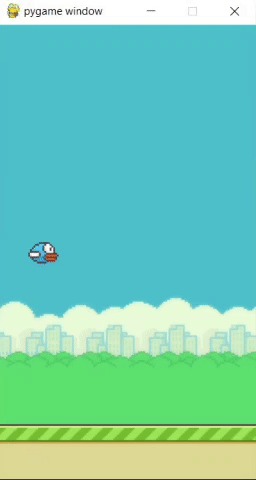

### Agregando los tubos

Para agregar los tubos agregaremos el siguiente código, que explicaremos en varios segmentos.

<pre><code>import pygame, sys, random

<div style="background: #B3FFC6">def crear_tubo():
  tubo_nuevo = superficie_tubo.get_rect(midtop = (350,256))
  return tubo_nuevo

def mover_tubos(tubos):
  for tubo in tubos:
    tubo.centerx -= 5
  return tubos

def mostrar_tubos(tubos):
  for tubo in tubos:
    pantalla.blit(superficie_tubo,tubo)

</div>pygame.init()
pantalla = pygame.display.set_mode((288,512))
reloj = pygame.time.Clock()
<div style="background: #CCE5FF">...</div>superficie_ave = pygame.image.load('assets/bluebird-midflap.png').convert()
rect_ave = superficie_ave.get_rect(center = (50,256))

<div style="background: #B3FFC6">superficie_tubo = pygame.image.load('assets/pipe-green.png').convert()
lista_tubos = []
SPAWNTUBO = pygame.USEREVENT
pygame.time.set_timer(SPAWNTUBO, 1200)

</div>while True:
  for event in pygame.event.get():
    if event.type == pygame.QUIT:
<div style="background: #CCE5FF">...</div>    if event.type == pygame.KEYDOWN:
      if event.key == pygame.K_SPACE:
        movimiento_ave = -7
<div style="background: #B3FFC6">    if event.type == SPAWNTUBO:
      lista_tubos.append(crear_tubo())
</div>
  pantalla.blit(superficie_fondo, (0,0))

<div style="background: #B3FFC6">  # Ave</div>  movimiento_ave += gravedad
  rect_ave.centery += movimiento_ave
  pantalla.blit(superficie_ave,rect_ave)
<div style="background: #B3FFC6">
  # Tubos
  lista_tubos = mover_tubos(lista_tubos)
  mostrar_tubos(lista_tubos)
  
  # Suelo</div>  pos_suelo_x -= 1
  pantalla.blit(superficie_suelo,(pos_suelo_x,450))
  pantalla.blit(superficie_suelo,(pos_suelo_x + 288,450))
</code></pre>

Lo primero que debemos hacer es agregar las siguientes variables:

```python
superficie_tubo = pygame.image.load('assets/pipe-green.png').convert()
lista_tubos = []
SPAWNTUBO = pygame.USEREVENT
pygame.time.set_timer(SPAWNTUBO, 1200)
```

En la primera línea creamos una superficie que almacenará la imagen del tubo
que tenemos en los recursos, y enseguida creamos una lista en donde almacenaremos todas las instancias de los tubos que estén en el juego.

La línea `SPAWNTUBO = pygame.USEREVENT` crea un evento de usuario, que será
el que le indique al juego cuando crear un nuevo tubo. Por último, la línea `pygame.time.set_timer(SPAWNTUBO, 1200)` establece que el evento `SPAWNTUBO`
sucederá cada 1.2 segundos, ya que el valor brindado está en milisegundos.

En seguida crearemos tres funciones que se encargarán de manejar la creación, el movimiento y el dibujado de los tubos, respectivamente.

```python
def crear_tubo():
  tubo_nuevo = superficie_tubo.get_rect(midtop = (350,256))
  return tubo_nuevo

def mover_tubos(tubos):
  for tubo in tubos:
    tubo.centerx -= 5
  return tubos

def mostrar_tubos(tubos):
  for tubo in tubos:
    pantalla.blit(superficie_tubo,tubo)
```

En la función `crear_tubo` creamos un tubo cuya parte superior está aproximadamente a la mitad de la pantalla. La función `mover_tubos` se encarga de mover a todos los tubos hacia la derecha, y la función `mostrar_tubos` se encarga de dibujarlos en la ventana del juego.

A continuación detectaremos el evento `SPAWNTUBO`, para que cuando suceda creemos un nuevo tubo, tal y como se muestra aquí.

```python
    if event.type == SPAWNTUBO:
      lista_tubos.append(crear_tubo())
```

Finalmente ejecutamos las funciones de movimiento y dibujado en cada ciclo, para mover y mostrar constantemente los tubos. Además agregamos comentarios para mantener un orden en nuestro código.

```python
  lista_tubos = mover_tubos(lista_tubos)
  mostrar_tubos(lista_tubos)
```

Si ejecutamos el juego en este punto, podremos ver como se nos acercan tubos de forma constante.

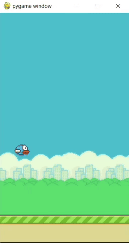

### Terminando los tubos

A continuación haremos que la altura de los tubos varíe de forma aleatoria, generaremos los tubos de arriba y eliminaremos los tubos que ya no estén en pantalla para evitar sobrecargar al juego.

<pre><code>
import pygame, sys, random

def crear_tubo():
<div style="background: #FFCCD2">  tubo_nuevo = superficie_tubo.get_rect(midtop = (350,256))
  return tubo_nuevo</div><div style="background: #B3FFC6">  altura_random =random.choice(altura_tubo)
  tubo_abajo = superficie_tubo.get_rect(midtop = (350,altura_random))
  tubo_arriba = superficie_tubo.get_rect(midbottom = (350,altura_random - 150))
  return tubo_abajo, tubo_arriba</div>
def mover_tubos(tubos):
  for tubo in tubos:
    tubo.centerx -= 5
<div style="background: #FFCCD2">  return tubos</div><div style="background: #B3FFC6">  tubos_visibles = [tubo for tubo in tubos if tubo.right > -50]
  return tubos_visibles</div>

def mostrar_tubos(tubos):
  for tubo in tubos:
<div style="background: #B3FFC6">    if tubo.bottom >= 512:</div>      pantalla.blit(superficie_tubo,tubo)
<div style="background: #B3FFC6">    else:
      voltear_tubo = pygame.transform.flip(superficie_tubo,False,True)
      pantalla.blit(voltear_tubo,tubo)</div>
pygame.init()
pantalla = pygame.display.set_mode((288,512))
<div style="background: #CCE5FF">...</div>lista_tubos = []
SPAWNTUBO = pygame.USEREVENT
pygame.time.set_timer(SPAWNTUBO, 1200)
<div style="background: #B3FFC6">altura_tubo = [200,300,400]</div>
while True:
  for event in pygame.event.get():
<div style="background: #CCE5FF">...</div>      if event.key == pygame.K_SPACE:
        movimiento_ave = -7
    if event.type == SPAWNTUBO:
<div style="background: #FFCCD2">      lista_tubos.append(crear_tubo())</div><div style="background: #B3FFC6">      lista_tubos.extend(crear_tubo())</div>
  pantalla.blit(superficie_fondo, (0,0))

</code></pre>

Para establecer las posibles alturas de los tubos, agregamos una lista con las alturas que queremos que tengan.

```python
altura_tubo = [200,300,400]
```

Para asignar estas alturas de forma aleatoria y agregar los tubos de arriba, modificamos la función `crear_tubo` de forma que quede así:

```python
def crear_tubo():
  altura_random =random.choice(altura_tubo)
  tubo_abajo = superficie_tubo.get_rect(midtop = (350,altura_random))
  tubo_arriba = superficie_tubo.get_rect(midbottom = (350,altura_random - 150))
  return tubo_abajo, tubo_arriba
```

Para poder agregar dos tubos a la lista al mismo tiempo, reemplazaremos la línea `lista_tubos.append(crear_tubo())` por `lista_tubos.extend(crear_tubo())`.

Para voltear los tubos superiores de forma que su boca quede apuntando hacia abajo, modificaremos la función `mostrar_tubos` de la siguiente forma:

```python
def mostrar_tubos(tubos):
  for tubo in tubos:
    if tubo.bottom >= 512:
      pantalla.blit(superficie_tubo,tubo)
    else:
      voltear_tubo = pygame.transform.flip(superficie_tubo,False,True)
      pantalla.blit(voltear_tubo,tubo)
```

Finalmente, para eliminar los tubos que ya hayan desaparecido, modificaremos la función `mover_tubos` para que elimine los tubos que vayan llegando a la izquierda.

```python
def mover_tubos(tubos):
  for tubo in tubos:
    tubo.centerx -= 5
  tubos_visibles = [tubo for tubo in tubos if tubo.right > -50]
  return tubos_visibles
```

Si ejecutamos el juego en este momento, veremos que los tubos funcionan perfectamente, aunque aún no funcionan las colisiones.

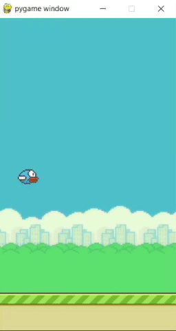

### Creando el sistema de colisiones

Para que el juego funcione, este debe detectar cuando el ave choca con los tubos, el suelo o cuando vuela demasiado arriba. Además debe poder reiniciarse luego de que el jugador pierda, para lo que agregaremos el código siguiente:

<pre><code><div style="background: #CCE5FF">...</div>      voltear_tubo = pygame.transform.flip(superficie_tubo,False,True)
      pantalla.blit(voltear_tubo,tubo)

<div style="background: #B3FFC6">def detectar_colisiones(tubos):
  for tubo in tubos:
    if rect_ave.colliderect(tubo):
      return False

  if rect_ave.top <= -50 or rect_ave.bottom >= 450:
    return False

  return True

</div>pygame.init()
pantalla = pygame.display.set_mode((288,512))
reloj = pygame.time.Clock()

# Variables del Juego
gravedad = 0.25
movimiento_ave = 0
<div style="background: #B3FFC6">juego_activo = True</div>
superficie_fondo = pygame.image.load('assets/background-day.png').convert()
superficie_suelo = pygame.image.load('assets/base.png').convert()
<div style="background: #CCE5FF">...</div>      sys.exit()
    if event.type == pygame.KEYDOWN:
      if event.key == pygame.K_SPACE:
<div style="background: #B3FFC6">        if juego_activo:</div>          movimiento_ave = -7
<div style="background: #B3FFC6">        else:
          juego_activo = True
          lista_tubos.clear()
          rect_ave.center = (50,256)
          movimiento_ave = 0

</div>    if event.type == SPAWNTUBO:
      lista_tubos.extend(crear_tubo())

  pantalla.blit(superficie_fondo, (0,0))

<div style="background: #B3FFC6">  if juego_activo:</div>    # Ave
    movimiento_ave += gravedad
    rect_ave.centery += movimiento_ave
    pantalla.blit(superficie_ave,rect_ave)
<div style="background: #B3FFC6">    juego_activo = detectar_colisiones(lista_tubos)</div>
    # Tubos
    lista_tubos = mover_tubos(lista_tubos)
</code></pre>

Lo primero que haremos es crear una variable para saber si el juego está activo o si el jugador ha perdido, para lo que añadimos la línea `juego_activo = True`.

Enseguida crearemos una función que se encargará de detectar las colisiones con los tubos, el suelo y el "techo" del juego, y que devolverán un valor booleano de acuerdo con el resultado obtenido.

```python
def detectar_colisiones(tubos):
  for tubo in tubos:
    if rect_ave.colliderect(tubo):
      return False

  if rect_ave.top <= -50 or rect_ave.bottom >= 450:
    return False

  return True
```

A continuación condicionaremos el movimiento del ave, los tubos y el suelo de acuerdo con el estado del juego, mediante la línea `if juego_activo:`, además de llamar a la función `detectar_colisiones` mientras el juego siga activo.

Finalmente, para poder reiniciar el juego condicionaremos la acción a realizar cuando se presione la barra espaciadora. Si el juego está activo, hará que el ave salte, y en caso contrario, restablecerá los valores iniciales de los tubos y del ave, tal y como se muestra a continuación:

```python
if event.key == pygame.K_SPACE:
  if juego_activo:
    movimiento_ave = -7
  else:
    juego_activo = True
    lista_tubos.clear()
    rect_ave.center = (50,256)
    movimiento_ave = 0
```

Si ejecutamos el juego ahora, este se detendrá al chocar con un obstáculo, y podremos reiniciarlo al presionar la barra espaciadora.

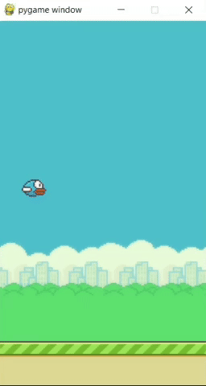

### Girando el ave

Para girar el ave crearemos una función que se encargue de rotarla en función de su velocidad, y entonces la llamaremos en cada ciclo para dibujar el ave girada en lugar del ave original. Además deberemos modificar la línea donde creamos la superficie para que al girarla el fondo del ave no se vuelva negro.

<pre><code><div style="background: #CCE5FF">...</div>
  return True

<div style="background: #B3FFC6">def girar_ave(ave):
  nueva_ave = pygame.transform.rotozoom(ave,-movimiento_ave * 3,1)
  return nueva_ave

</div>pygame.init()
pantalla = pygame.display.set_mode((288,512))
reloj = pygame.time.Clock()
<div style="background: #CCE5FF">...</div>superficie_suelo = pygame.image.load('assets/base.png').convert()
pos_suelo_x = 0

<div style="background: #FFCCD2">superficie_ave = pygame.image.load('assets/bluebird-midflap.png').convert()</div><div style="background: #B3FFC6">superficie_ave = pygame.image.load('assets/bluebird-midflap.png').convert_alpha()</div>rect_ave = superficie_ave.get_rect(center = (50,256))

superficie_tubo = pygame.image.load('assets/pipe-green.png').convert()
<div style="background: #CCE5FF">...</div>
    # Ave
    movimiento_ave += gravedad
    rect_ave.centery += movimiento_ave
<div style="background: #FFCCD2">    pantalla.blit(superficie_ave,rect_ave)</div><div style="background: #B3FFC6">    ave_girada = girar_ave(superficie_ave)
    pantalla.blit(ave_girada,rect_ave)</div>    juego_activo = detectar_colisiones(lista_tubos)

    # Tubos
</code></pre>

Si ejecutamos el juego en este punto veremos como el ave gira cuando cae y
cuando salta.

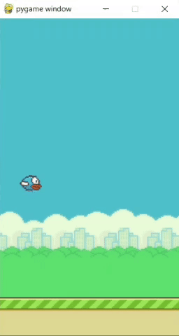

### Animando el ave

Para darle más vida a nuestra ave, vamos a agregar una animación en sus alas mediante el uso de sprites, tal y como se muestra a continuación.

<pre><code><div style="background: #CCE5FF">...</div>  nueva_ave = pygame.transform.rotozoom(ave,-movimiento_ave * 3,1)
  return nueva_ave

<div style="background: #B3FFC6">def animacion_ave():
  nueva_ave = cuadros_ave[index_ave]
  nuevo_rect_ave = nueva_ave.get_rect(center = (50,rect_ave.centery))
  return nueva_ave,nuevo_rect_ave

</div>pygame.init()
pantalla = pygame.display.set_mode((288,512))
reloj = pygame.time.Clock()
<div style="background: #CCE5FF">...</div>superficie_suelo = pygame.image.load('assets/base.png').convert()
pos_suelo_x = 0

<div style="background: #FFCCD2">superficie_ave = pygame.image.load('assets/bluebird-midflap.png').convert_alpha()</div><div style="background: #B3FFC6">ave_bajo = pygame.image.load('assets/bluebird-downflap.png').convert_alpha()
ave_medio = pygame.image.load('assets/bluebird-midflap.png').convert_alpha()
ave_alto = pygame.image.load('assets/bluebird-upflap.png').convert_alpha()
cuadros_ave = [ave_bajo,ave_medio,ave_alto]
index_ave = 0
superficie_ave = cuadros_ave[index_ave]</div>rect_ave = superficie_ave.get_rect(center = (50,256))

<div style="background: #B3FFC6">FLAPAVE = pygame.USEREVENT + 1
pygame.time.set_timer(FLAPAVE, 200)

</div>superficie_tubo = pygame.image.load('assets/pipe-green.png').convert()
lista_tubos = []
SPAWNTUBO = pygame.USEREVENT
<div style="background: #CCE5FF">...</div>    if event.type == SPAWNTUBO:
      lista_tubos.extend(crear_tubo())

<div style="background: #B3FFC6">    if event.type == FLAPAVE:
      if index_ave < 2:
        index_ave += 1
      else:
        index_ave = 0

      superficie_ave,rect_ave = animacion_ave()

</div>  pantalla.blit(superficie_fondo, (0,0))

  if juego_activo:
</code></pre>

Lo primero que debemos hacer es reemplazar la definición de la superficie del ave, para tener los 3 sprites guardados en una lista, y tener guardado en una variable cuál de los 3 es el que se usa actualmente.

```python
ave_bajo = pygame.image.load('assets/bluebird-downflap.png').convert_alpha()
ave_medio = pygame.image.load('assets/bluebird-midflap.png').convert_alpha()
ave_alto = pygame.image.load('assets/bluebird-upflap.png').convert_alpha()
cuadros_ave = [ave_bajo,ave_medio,ave_alto]
index_ave = 0
superficie_ave = cuadros_ave[index_ave]
```

Enseguida creamos un nuevo `USEREVENT` que se activa cada 0.2 segundos para cambiar la imagen del ave constantemente.

```python
FLAPAVE = pygame.USEREVENT + 1
pygame.time.set_timer(FLAPAVE, 200)
```

A continuación crearemos una función que se encargará de cambiar la imagen del ave y de actualizar el rectángulo de acuerdo con este cambio:

```python
def animacion_ave():
  nueva_ave = cuadros_ave[index_ave]
  nuevo_rect_ave = nueva_ave.get_rect(center = (50,rect_ave.centery))
  return nueva_ave,nuevo_rect_ave
```

Finalmente detectaremos el `USEREVENT` para que se cambie el índice y llame a la función que acabamos de crear.

```python
if event.type == FLAPAVE:
      if index_ave < 2:
        index_ave += 1
      else:
        index_ave = 0

      superficie_ave,rect_ave = animacion_ave()
```

Ahora podremos ver cómo se mueven las alas del ave en el juego.

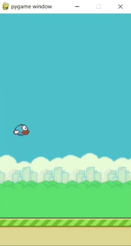

### Agregando el sistema de puntuación

Para agregar la puntuación a nuestro juego y para mostrarlo en pantalla tendremos que agregar el siguiente código:

<pre><code><div style="background: #CCE5FF">...</div>      pantalla.blit(voltear_tubo,tubo)

def detectar_colisiones(tubos):
<div style="background: #B3FFC6">  global score_activo

</div>  for tubo in tubos:
    if rect_ave.colliderect(tubo):
<div style="background: #B3FFC6">      score_activo = True
</div>      return False

  if rect_ave.top <= -50 or rect_ave.bottom >= 450:
<div style="background: #B3FFC6">    score_activo = True
</div>    return False

  return True
<div style="background: #CCE5FF">...</div>  nuevo_rect_ave = nueva_ave.get_rect(center = (50,rect_ave.centery))
  return nueva_ave,nuevo_rect_ave

<div style="background: #B3FFC6">def mostrar_score(estado_juego):
  if estado_juego == 'activo':
    superficie_score = fuente.render(str(score),True,(255,255,255))
    rect_score = superficie_score.get_rect(center = (144,50))
    pantalla.blit(superficie_score,rect_score)
  if estado_juego == 'game_over':
    superficie_score = fuente.render(f'Score: {score}',True,(255,255,255))
    rect_score = superficie_score.get_rect(center = (144,50))
    pantalla.blit(superficie_score,rect_score)
    
    superficie_high_score = fuente.render(f'High score: {high_score}',True,(255,255,255))
    rect_high_score = superficie_high_score.get_rect(center = (144,425))
    pantalla.blit(superficie_high_score,rect_high_score)

def actualizar_high_score(score, high_score):
  if score > high_score:
    high_score = score
  return high_score

def revisar_score():
  global score, score_activo
  
  if lista_tubos:
    for tubo in lista_tubos:
      if 45 < tubo.centerx < 55 and score_activo:
        score += 1
        score_activo = False
      if tubo.centerx < 0:
        score_activo = True

</div>pygame.init()
pantalla = pygame.display.set_mode((288,512))
reloj = pygame.time.Clock()
<div style="background: #B3FFC6">fuente = pygame.font.Font('04B_19.ttf',20)
</div>
# Variables del Juego
gravedad = 0.25
movimiento_ave = 0
juego_activo = True
<div style="background: #B3FFC6">score = 0
high_score = 0
score_activo = True
</div>
superficie_fondo = pygame.image.load('assets/background-day.png').convert()
superficie_suelo = pygame.image.load('assets/base.png').convert()
<div style="background: #CCE5FF">...</div>          lista_tubos.clear()
          rect_ave.center = (50,256)
          movimiento_ave = 0
<div style="background: #B3FFC6">          score = 0
</div>
    if event.type == SPAWNTUBO:
      lista_tubos.extend(crear_tubo())
<div style="background: #CCE5FF">...</div>    lista_tubos = mover_tubos(lista_tubos)
    mostrar_tubos(lista_tubos)
    
<div style="background: #B3FFC6">    # Score
    revisar_score()
    mostrar_score('activo')

</div>    # Suelo
    pos_suelo_x -= 1
<div style="background: #B3FFC6">  else:
    high_score = actualizar_high_score(score,high_score)
    mostrar_score('game_over')

</div>  pantalla.blit(superficie_suelo,(pos_suelo_x,450))
  pantalla.blit(superficie_suelo,(pos_suelo_x + 288,450))
  if pos_suelo_x <= -288:
</code></pre>

Lo primero que agregaremos son las variables `score`, para almacenar la puntuación actual del jugador, y `high_score` para almacenar la puntuación más alta obtenida por el jugador.

Enseguida crearemos la función `revisar_score`, que aumentará 1 punto al jugador cada vez que pase por la mitad de un tubo. Además utilizaremos una variable llamada `score_activo`, que pausará el aumento de puntuación para evitar que se aumenten 2 puntos al mismo tiempo, y que volveremos a activar cuando los tubos salgan de la pantalla.

```python
def revisar_score():
  global score, score_activo

  if lista_tubos:
    for tubo in lista_tubos:
      if 45 < tubo.centerx < 55 and score_activo:
        score += 1
        score_activo = False
      if tubo.centerx < 0:
        score_activo = True
```

Además crearemos la función `actualizar_high_score`, que nos permitirá actualizar el valor del `high_score` cuando el usuario lo supere.

```python
def actualizar_high_score(score, high_score):
  if score > high_score:
    high_score = score
  return high_score
```

También deberemos actualizar la función `detectar_colisiones` para que reactive `score_activo` cuando el usuario pierda, y estableceremos el valor de `score` en 0 cuando el usuario inicie una nueva partida.

```python
def detectar_colisiones(tubos):
  global score_activo

  for tubo in tubos:
    if rect_ave.colliderect(tubo):
      score_activo = True
      return False

  if rect_ave.top <= -50 or rect_ave.bottom >= 450:
    score_activo = True
    return False

  return True
```

Para mostrar el score y el high score en la pantalla necesitaremos importar la fuente en la que mostraremos el texto, lo cual realizaremos con la siguiente línea, donde indicamos el archivo de la fuente y el tamaño que esta tendrá.

```python
fuente = pygame.font.Font('04B_19.ttf',20)
```

Enseguida crearemos la función `mostrar_score`. Esta función crea una superficie en la que mostramos el score en color blanco, y utilizamos un rectángulo para poderlo centrar en la pantalla del juego. Si estamos en el game over en vez de mostrar únicamente el score mostrará el score en la parte superior de la pantalla y el high score en la parte inferior.

```python
def mostrar_score(estado_juego):
  if estado_juego == 'activo':
    superficie_score = fuente.render(str(score),True,(255,255,255))
    rect_score = superficie_score.get_rect(center = (144,50))
    pantalla.blit(superficie_score,rect_score)
  if estado_juego == 'game_over':
    superficie_score = fuente.render(f'Score: {score}',True,(255,255,255))
    rect_score = superficie_score.get_rect(center = (144,50))
    pantalla.blit(superficie_score,rect_score)

    superficie_high_score = fuente.render(f'High score: {high_score}',True,(255,255,255))
    rect_high_score = superficie_high_score.get_rect(center = (144,425))
    pantalla.blit(superficie_high_score,rect_high_score)
```

Por último, llamamos a las funciones que creamos en cada ciclo para actualizar y mostrar el score y el high score de forma constante.

Si jugamos en este momento, ya podremos ver nuestra puntuación.

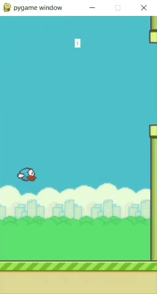

### Agregando la pantalla de game over

Para agregar la pantalla de game over, crearemos una superficie con la imagen y la situaremos en el centro de la pantalla, para mostrarla cuando el usuario haya perdido.

<pre><code><div style="background: #CCE5FF">...</div>pygame.time.set_timer(SPAWNTUBO, 1200)
altura_tubo = [200,300,400]

<div style="background: #B3FFC6">superficie_game_over = pygame.image.load('assets/message.png').convert_alpha()
rect_game_over = superficie_game_over.get_rect(center = (144,256))

</div>while True:
  for event in pygame.event.get():
    if event.type == pygame.QUIT:
<div style="background: #CCE5FF">...</div>    # Suelo
    pos_suelo_x -= 1
  else:
<div style="background: #B3FFC6">    pantalla.blit(superficie_game_over,rect_game_over)</div>    high_score = actualizar_high_score(score,high_score)
    mostrar_score('game_over')
 
</code></pre>

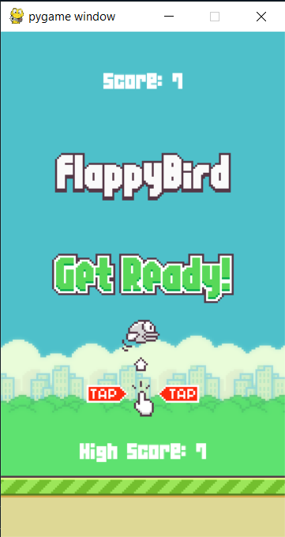

### Agregando el sonido

¡Nuestro juego está prácticamente terminado! Lo único que nos falta es agregar los sonidos para que este se sienta más vivo. Los sonidos que añadiremos serán el de salto, muerte y puntuación, lo cual haremos como se muestra en el código a continuación:

<pre><code><div style="background: #CCE5FF">...</div>
  for tubo in tubos:
    if rect_ave.colliderect(tubo):
<div style="background: #B3FFC6">      sonido_muerte.play()</div>      score_activo = True
      return False

  if rect_ave.top <= -50 or rect_ave.bottom >= 450:
<div style="background: #B3FFC6">    sonido_muerte.play()</div>    score_activo = True
    return False

<div style="background: #CCE5FF">...</div>    for tubo in lista_tubos:
      if 45 < tubo.centerx < 55 and score_activo:
        score += 1
<div style="background: #B3FFC6">        sonido_score.play()</div>        score_activo = False
      if tubo.centerx < 0:
        score_activo = True
<div style="background: #CCE5FF">...</div>superficie_game_over = pygame.image.load('assets/message.png').convert_alpha()
rect_game_over = superficie_game_over.get_rect(center = (144,256))

<div style="background: #B3FFC6">sonido_flap = pygame.mixer.Sound('sound/sfx_wing.wav')
sonido_muerte = pygame.mixer.Sound('sound/sfx_hit.wav')
sonido_score = pygame.mixer.Sound('sound/sfx_point.wav')

</div>while True:
  for event in pygame.event.get():
    if event.type == pygame.QUIT:
<div style="background: #CCE5FF">...</div>      if event.key == pygame.K_SPACE:
        if juego_activo:
          movimiento_ave = -7
<div style="background: #B3FFC6">          sonido_flap.play()</div>        else:
          juego_activo = True
          lista_tubos.clear()
</code></pre>

Lo primero que hacemos es crear 3 variables en las que almacenaremos los sonidos que utilizaremos en el juego:

```python
sonido_flap = pygame.mixer.Sound('sound/sfx_wing.wav')
sonido_muerte = pygame.mixer.Sound('sound/sfx_hit.wav')
sonido_score = pygame.mixer.Sound('sound/sfx_point.wav')
```

Lo único que tenemos que hacer entonces es reproducirlos mediante el método `.play()` cuando queremos que se reproduzcan. El de salto cuando el usuario salta, el de muerte cuando el ave muere y el de puntuación cuando el usuario pasa entre los tubos.

¡Lo único que resta por hacer es disfrutar nuestro juego!
